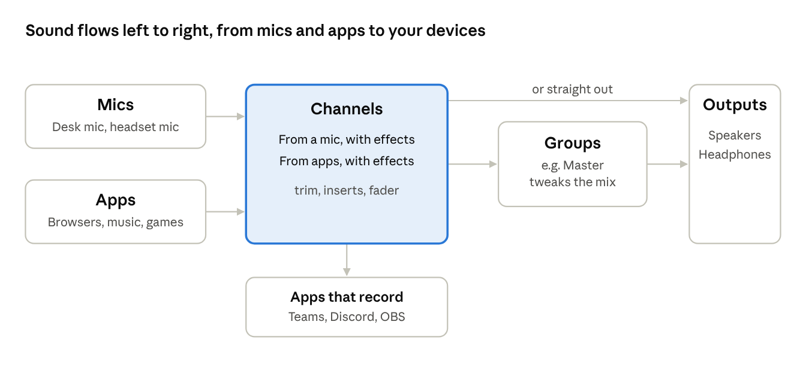

# Audio Router — User Guide

## What Audio Router does

Audio Router lets you decide where every app's sound and every microphone goes, and gives each route its own volume and effects. It works like a small mixing desk on your Linux computer.

One idea runs through all of it: **sound flows left to right.** Microphones and apps feed **channels**. A channel cleans up or shapes the sound with **effects**, then sends it on, either to a real device (speakers, headphones) or into another channel. When several channels feed one channel, that channel is a **group**, a place for final tweaks on the combined sound.

A few examples of what this makes possible:

- Music on the speakers and a game on the headphones, each at its own level.
- A microphone with noise removal and echo cancellation, which Teams or Discord then use as their mic.
- Music mixed into your call microphone so the other side hears it.
- Several channels sent through one Master group with a limiter on it.

## Getting started

Open **Audio Router** from the application menu. The window opens on the **Mixer** tab; the **Channels** tab next to it holds every setting for one channel at a time. The **User Guide** button opens this guide, and **About** shows the version, credits and system details, with **Copy details** for a bug report.

Two checkboxes along the top control how Audio Router behaves:

| Checkbox | What it does |
| --- | --- |
| Send new apps to their usual channel | When an app starts playing, it goes straight to the channel you last chose for it. Untick it and nothing is moved automatically. |
| Keep routing with this window closed, and from login | Runs a small background service, so your channels start when you log in and apps are routed even with the window closed. |

Your settings save themselves as you change them. Nothing needs saving or applying by hand.

### Bypass

The **Bypass** button, left of the checkboxes, switches Audio Router off without losing anything. Every channel stops, mic channels included, and nothing is routed: apps play straight to your default speakers or headphones, and record from your default microphone, exactly as if Audio Router were not installed. A banner across the window says so.

Click it again (it reads **Bypassed** while on) and everything comes back: every channel with its effects, and every playing app is sent to its usual channel. Nothing you set up is changed or forgotten.

Bypass stays on across logout and restart until you switch it off. It is the quickest way to answer "is Audio Router the cause of this sound problem?"

## The mixer at a glance

The Mixer tab reads left to right in the order sound travels, in four sections:

A channel either plays straight to a device or into a group first; mic channels are also offered to apps that record, such as Teams.

| Section | What sits there |
| --- | --- |
| **Mics** | Your real microphones, each with its own volume, mute and level meter. |
| **Channels** | Every channel, whether it takes a microphone or apps. Its label says which: **From a mic**, **From apps** or **Cable**. |
| **Groups** | Channels that other channels play into. This section appears once a group exists. |
| **Outputs** | Your real speakers and headphones, each with its own volume, mute and meter. |

The **+** button beside Channels makes a new channel: pick **Channel for a microphone** or **Channel for apps**. If the desk is wider than the window, scroll sideways.

## A channel strip, control by control

Every channel is one upright strip, read top to bottom in the order the sound passes through it. A greyed-out name means the channel is not running.

| Control | What it does |
| --- | --- |
| **Name and label** | The channel's name, and where its sound comes from: From a mic, From apps, Cable (apps can record it) or Group. |
| **Source** | On a mic channel, the microphone it records from. On other channels, the apps playing into it, or a group's members ("from Speakers, Game"). Hover to see a long list in full. |
| **+ apps** | On a mic channel, apps mixed into that microphone, such as "+ Spotify". |
| **TRIM** | The channel's volume before its effects. It is the same volume the desktop's sound settings show. Turn it down if the effects are being overdriven. |
| **INSERTS** | The channel's effects, in order. Click one to switch it on or off; a lit insert is on. Double-click to open its settings. **+ Insert** adds an effect. Click the INSERTS title to fold the list on every strip. |
| **OUT** | Where the channel goes: the default output, a real device, **Into** another channel (making that a group), **Into** a mic channel, or **Nowhere** (recording only). |
| **LISTEN** | On a mic channel instead of OUT: play the microphone through an output channel so you hear yourself. |
| **PAN** | Balance between left and right, after the fader. **C** is centre; **L40** or **R100** lean that way. Double-click to centre. |
| **M** | Mute the channel. |
| **S** | Solo: hear only this channel. Every other channel of the same kind is cut and says **cut by a solo**. A soloed channel's group, and a soloed group's members, keep playing. |
| **Edit** | Open this channel in the Channels tab. |
| **Fader** | The level after the effects, from off at the bottom to +10 dB at the top; 0 dB is unchanged. |
| **Meter** | The channel's output level, left and right: green to -18 dB, amber to -6 dB, red above. **CLIP** means it hit the top. |

TRIM and the fader do different jobs. TRIM sets how hard the effects are driven; the fader sets the final level without changing how an effect such as a compressor behaves.

## Mic and output strips

The narrow strips at the two ends of the desk are your real devices, not channels. Each has three controls:

- **Volume:** the device's own volume, the same one the desktop's sound settings show. On a microphone it sets how loud that mic is for every channel and app that uses it. On an output it is the last control before the sound reaches your ears.
- **M:** mute the device. Muting a microphone here mutes it everywhere.
- **Meter:** what the microphone picks up, or what the output is playing.

While the Mixer tab is on screen, the desktop may show its "microphone in use" icon: the meters need to listen to your mics to move. Switch to the Channels tab or minimise the window and they stop.

A Bluetooth headset's microphone only appears while the headset is in its call (headset) mode, and in that mode its playback drops to lower-quality mono. That is how Bluetooth works, not a fault in Audio Router.

## Sending apps to channels

The **Playing now** panel at the bottom lists every app making sound and the channel it plays through, and every app recording (see below). Click the heading to fold it away; the number beside it counts the apps. Drag the line just above it up or down to make it taller or shorter; the window remembers the height.

1. Find the app in the list.
2. Pick a channel in its **Send to** column. The app moves at once.
3. The first time you send an app anywhere, Audio Router remembers it, and that app goes to the same channel whenever it plays again.

A mic channel appears in Send to as **"Name (into the mic)"**. Sending an app there mixes it into that microphone, so a call hears it.

| Button or list | What it does |
| --- | --- |
| **Always send this app here** | Makes the selected app's current channel its remembered channel, replacing an older choice. |
| **Remembered apps** | Every app Audio Router will place automatically, and where. |
| **Forget** | Removes the selected app from Remembered apps; it stays where it is for now. |

Automatic placing only happens while **Send new apps to their usual channel** is ticked.

## Recording a channel (Audacity, OBS, a call)

Apps that are recording appear in **Playing now** too, marked **Recording**. Their menu picks what they hear: any mic channel, or any channel whose **Recording apps see it as** is on.

1. In the recording app, leave the microphone on its default (in Audacity: **Audio Setup → Recording Device → default**) and start recording.
2. In **Playing now**, pick the channel in its **record from** menu. The recording switches at once.
3. Audio Router remembers that choice, so next time the app records from the same channel the moment it starts.

The app's own device list never shows your channels by name: Audacity and other ALSA apps only list sound cards. Choosing in Playing now is the way in. **Always record from here** and **Forget** work as they do for playing apps; Remembered apps shows these as "app records Channel".

## Mic channels

A mic channel takes a real microphone, runs it through its effects, and offers the result to other apps as a new microphone with the channel's name. In Teams, Discord or OBS, choose that name as the microphone.

- **Source:** the real microphone, or **Default input** to follow the desktop's choice. A chosen mic that is unplugged is never swapped for another one.
- **Echo cancellation:** removes whatever your speakers are playing from the microphone, so a call hears you and not your music or game. On for every new mic channel; turn it off in the Channels tab if you use headphones.
- **LISTEN:** plays the processed microphone through an output channel so you can hear yourself. Choose **Don't listen** to stop. Listening on speakers can cause feedback.
- **Mixing apps in:** send an app to "Name (into the mic)" in Playing now, or set another channel's OUT to **Into Name (mic)**. Whatever you send there is heard by everyone using that microphone, on top of your voice.

A mic channel only opens the real microphone while something is using it, unless echo cancellation is on, which keeps it open.

## Groups

A group is a channel that other channels play into, so you can treat their combined sound as one: add a limiter, set one level, or mute them together.

1. Make a channel for apps to act as the group, for example "Master", and set its OUT to your speakers.
2. On each channel that should join it, set OUT to **Into Master**.
3. Master moves to the **Groups** section and its strip reads "from Music, Game". Its effects and fader now act on everything feeding it.

A channel's OUT list never offers a channel that would send the sound round in a loop. Deleting a group sends its members back to the default output.

Switching a group off sends its members straight to the default output, unprocessed, like any switched-off channel; they rejoin the group when it is back on. To silence a group, **mute** it instead.

## Effects

Each channel has its own chain of effects, applied top to bottom. Changes are heard immediately; turning a knob never interrupts the sound.

- **Add:** click **+ Insert** on a strip, or **Add effect...** in the Channels tab. The list groups effects by kind, and includes any compatible audio plugins installed on the computer.
- **On and off:** click the insert on the strip, or tick its box in the Channels tab. Switching fades smoothly rather than clicking.
- **Settings:** double-click an insert, or select it in the Channels tab, and move its sliders. **Reset settings** returns them to the defaults.
- **Order:** **Up** and **Down** in the Channels tab move an effect earlier or later in the chain. **Remove** deletes it.

The built-in effects:

| Effect | Use it to |
| --- | --- |
| Volume trim | Raise or lower the level, to match channels by ear. |
| High-pass | Remove bass below a cutoff; protects small speakers and cuts mic rumble. |
| Low-pass | Remove treble above a cutoff. |
| Tone band | Boost or cut one band of frequencies. |
| Bass shelf / Treble shelf | Boost or cut everything below or above a frequency. |
| Compressor | Even out loud and quiet parts. |
| Limiter | Stop the level going over a ceiling. |
| Delay | Delay the sound, for example to line it up with video. |
| Voice noise suppression | Remove background noise from a voice. |

An effect whose plugin is no longer installed is marked unavailable; it can still be switched off or removed.

## The Channels view

The Channels tab shows every setting for one channel. The list on the left holds every channel in the same order as the mixer, left to right, each with its mixer label: **From a mic**, **From apps**, **Cable** or **Group**. **New channel** offers a channel for a microphone or for apps; **Delete** removes the selected one. A channel marked "(off)" is switched off; "(not running)" means it should be on but is not.

Every channel's settings read the same way as its strip, top to bottom in the order the sound travels: **IN**, **LEVEL**, **OUT**.

| Section | Setting | What it does |
| --- | --- | --- |
| | Name | The channel's name, also what other apps see. Its mixer label is shown beside it. |
| IN | Source | On a mic channel, the microphone it records (**Default input** follows the desktop's choice). On any other channel, the apps and channels you send to it. |
| IN | Echo cancellation | On a mic channel: keep the speakers out of the mic. |
| IN | Channels in | The channels playing into this one, which makes it a group (or, on a mic channel, mixes them into the mic). |
| IN | Playing in | The apps playing into the channel right now. On a mic channel, the apps mixed into the mic. |
| IN | Remembered | The apps that always start on this channel. **Add app** picks one that is playing now or remembered on another channel, or **Another app...** to type a name. **Forget** stops sending one here. The same list as Remembered apps under Playing now. |
| LEVEL | Trim and Mute | The same as TRIM and M on the mixer strip: the volume before the effects. |
| LEVEL | Fader | The same as the mixer's fader; the two stay in step. |
| OUT | Plays through | Where the channel's sound goes: a device, **Into** another channel, or **Nowhere**. On a mic channel this is where you hear yourself (the strip's LISTEN); **Nowhere** means only recording apps get it. |
| OUT | Recording apps see it as | Offers the channel's processed sound as a microphone in other apps, so OBS, Teams or a recorder can use it. Always on for a mic channel, since that is what it is for. |
| | Switched on | Untick to stop the channel without deleting it. |

Below the settings, **Levels** shows what goes into and comes out of the channel. With **Show the highlighted effect** ticked, it shows what the effect selected in the Effects list receives and puts out instead. Under that, the **Effects** list and the selected effect's settings.

## Warnings and how to fix them

| You see | What it means | What to do |
| --- | --- | --- |
| **Echo cancellation stopped working** (a banner, or a desktop notification) | Part of the sound system was restarted on its own, which breaks echo cancellation until the whole sound system restarts. | Click **Restart the sound system**. Every sound stops for a few seconds, then your channels come back. |
| A banner naming **EasyEffects** | EasyEffects is running. It moves every app onto its own output, so apps cannot stay on your channels. | Quit EasyEffects, including its background service. |
| **No output devices - is anything plugged in?** | No speakers or headphones are connected. | Plug a device in or check the desktop's sound settings. |
| **(not connected)** after a device name | The channel's chosen device is unplugged. The channel keeps that choice rather than switching silently. | Plug it back in, or choose another device. |
| **not running** on a strip | The channel should be on but is not. | Usually clears within a second or two. If it stays, switch the channel off and on in the Channels tab. |
| **Bypassed** banner across the window | Bypass is on: every channel is stopped and nothing is routed. | Click **Bypassed** to bring everything back. |
| **cut by a solo** on a strip | Another channel of the same kind is soloed. | Turn off the lit **S**. |

## Glossary

| Term | Meaning |
| --- | --- |
| Channel | A route for sound with its own volume, effects and destination. |
| Mic channel | A channel that takes a real microphone and offers the result to other apps as a microphone. |
| Group | A channel that other channels play into. |
| Virtual cable | A channel whose sound other apps can record, like a microphone. |
| Insert | One effect in a channel's chain. |
| Trim | A channel's volume before its effects. |
| Fader | A channel's volume after its effects. |
| Pan | The balance between left and right. |
| Solo | Hear only one channel by cutting the others. |
| dB (decibel) | The unit for level. 0 dB leaves the level unchanged; -6 dB halves the signal, which sounds noticeably quieter; positive values are louder. |
| Echo cancellation | Removing the speakers' sound from a microphone. |
| Default output / input | Whichever speakers or microphone the desktop is set to use. |
